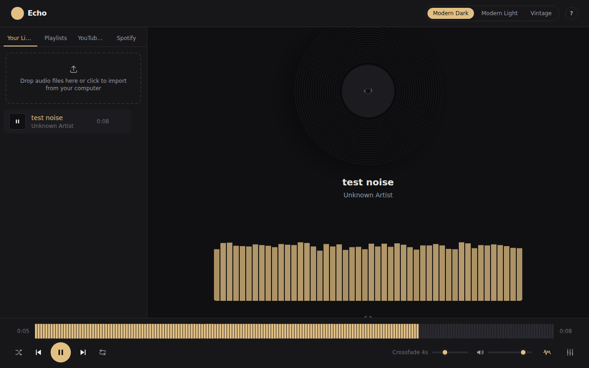
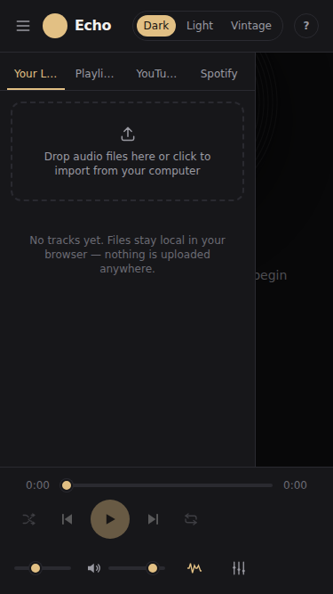

# Echo — Music Player

A browser-based music player for local files, with stubbed panels for
YouTube Music and Spotify. Built with React, TypeScript, Tailwind CSS, and
the Web Audio API. Everything runs client-side — imported audio never
leaves your browser.


<table>
  <tr>
    <td></td>
    <td></td>
  </tr>
  <tr>
    <td></td>
    <td></td>
  </tr>
  <tr>
    <td></td>
    <td></td>
  </tr>
</table>

## Features

- **Local playback** — import audio files from your computer (drag & drop
  or file picker). Files never leave the browser; ID3/metadata tags and
  embedded artwork are read client-side with `music-metadata`.
- **Dual-deck crossfade** — an adjustable 0–12s crossfade between tracks
  using equal-power gain curves, both on manual skip and automatic
  track-end.
- **Shuffle & repeat** — off / all / one, plus a "restart if >3s in"
  previous-track behavior.
- **5-band EQ** — lowshelf/peaking/highshelf `BiquadFilterNode` chain
  (60Hz–12kHz) with presets (Flat, Bass Boost, Vocal, Treble, Vintage
  Warmth) and an on/off toggle.
- **Visualizer** — canvas renderer with seven modes (Bars, Mirror Bars,
  Waveform, Vinyl Rings, Particles, Spectrogram, or Off), driven by an
  `AnalyserNode`; go fullscreen for an immersive view with an
  auto-fading transport bar.
- **Playlists** — create, rename, and delete playlists; add tracks from
  Your Library or search results via the + button on any track row;
  drag to reorder within a playlist; "Play all" starts the queue.
- **Persistent library** — imported files, their artwork, and playlists
  survive a page reload via IndexedDB (the actual audio/artwork blobs are
  stored, not just references — a fresh `blob:` URL is minted each load).
  Player preferences (volume, crossfade, shuffle/repeat, EQ, visualizer
  choice) persist too. Remove a track from Your Library with the trash
  icon on hover.
- **Gapless playback** — the next queued track preloads into the idle
  deck ahead of time, so a crossfade-off (instant) switch has no
  load/buffer gap between tracks.
- **Waveform seek bar** — local tracks show their actual amplitude shape
  (computed once on import, cached alongside the track) instead of a
  plain progress line; click or drag anywhere to seek.
- **Keyboard shortcuts** — Space to play/pause, ←/→ to seek, Shift+←/→
  for prev/next, ↑/↓ for volume, M to mute (see the **?** icon in the
  header). Disabled while typing in a field.
- **Mobile-responsive** — the sidebar becomes a slide-over drawer below
  the `sm` breakpoint (toggle via the header's menu icon), with a
  backdrop-tap-to-close and touch-friendly controls throughout.
- **Installable (PWA)** — the app shell (HTML/JS/CSS) is precached by a
  service worker, so it loads even offline. Previously-imported local
  tracks keep working offline too, since their audio lives in IndexedDB,
  not on a server.
- **Record scratching** — click-drag the vinyl to scrub through the
  track; playback speed pitch-bends with drag speed for an audible
  "scratch" feel. Audio itself is forward-only (browsers don't reliably
  support reverse playback), but seeking works in both directions.
- **Themes** — Modern Dark, Modern Light, and a warm Vintage theme
  (serif type, sepia palette), persisted to `localStorage`.
- **YouTube Music** — real search via the YouTube Data API v3 and
  playback via the YouTube IFrame Player API once you set
  `VITE_YOUTUBE_API_KEY` (see [YouTube setup](#youtube-setup) below).
  Without a key, the panel falls back to placeholder results. YouTube's
  embed is a cross-origin iframe, so EQ, crossfade, and the visualizer
  only apply to local files — YouTube tracks play/pause/seek/volume
  through their own player, shown in place of the vinyl art (YouTube's
  API terms require the player to stay visible while playing, so it's
  never hidden).
- **Spotify (stubbed)** — same `MusicSource` adapter interface as the
  other two, but returns placeholder results. Real integration needs an
  OAuth Client ID, a Premium account, and the Web Playback SDK (see
  `src/sources/spotifySource.ts`).

## Tech stack

React 19 · TypeScript · Vite · Tailwind CSS v4 · Zustand · Web Audio API ·
`music-metadata` · IndexedDB (via `idb`) · `vite-plugin-pwa`

## Installation

### Option A — Node.js (local dev or a plain static build)

Requires Node.js 20+.

```bash
git clone https://github.com/echofoxx/musicplayerstudio.git
cd musicplayerstudio
npm install
npm run dev
```

Open http://localhost:5173. For a production build:

```bash
npm run build      # typecheck + build to dist/
npm run preview    # serve dist/ locally to sanity-check it
```

`dist/` is a fully static site — you can host it on anything that serves
static files (GitHub Pages, Netlify, S3, an existing NGINX box, etc.).

### YouTube setup

Real YouTube Music search needs a free YouTube Data API v3 key (no OAuth
needed — playback uses the IFrame Player API, which needs no key at all):

1. Create/select a project at the
   [Google Cloud Console](https://console.cloud.google.com/apis/credentials)
2. Enable "YouTube Data API v3" for that project
3. Create an API key (restrict it to that API for safety)
4. Copy `.env.example` to `.env.local` and set `VITE_YOUTUBE_API_KEY`
5. Restart `npm run dev` (or rebuild) so Vite picks up the new env var

Without a key, the YouTube panel shows placeholder search results instead.

> **Note:** like all `VITE_`-prefixed env vars, the key gets compiled
> directly into the shipped JS bundle — anyone can read it out of your
> deployed site. Restrict the key (HTTP referrer + API restrictions) in
> the Cloud Console rather than treating it as a secret. If building via
> Docker, keep `.env.local` present at build time (it's copied into the
> build context and read by `npm run build` inside the image).

### Option B — Docker

No backend or database is required — the image is a multi-stage build
(Node builds it, NGINX serves the static output).

```bash
git clone https://github.com/echofoxx/musicplayerstudio.git
cd musicplayerstudio
docker compose up --build
```

Open http://localhost:8080. To use plain `docker` instead of Compose:

```bash
docker build -t musicplayerstudio .
docker run -p 8080:80 musicplayerstudio
```

If you ever see nginx's stock "Welcome to nginx!" page instead of the app,
it means an old image is being reused — force a clean rebuild:

```bash
docker compose down
docker rmi musicplayerwebapp-web   # or whatever `docker compose images` shows
docker compose build --no-cache
docker compose up
```

## Roadmap

- [x] Real YouTube Music search (YouTube Data API v3 key) + playback
      (YouTube IFrame Player API)
- [x] Larger visualizer + fullscreen immersive mode
- [x] Drag-to-scratch the record (scrub + pitch-bend, forward-only audio)
- [x] Playlists — create/rename/delete, add/remove/reorder tracks
- [x] Additional visualizer modes (Mirror Bars, Particles, Spectrogram)
- [x] Persist library + playlists across reloads (IndexedDB) and
      preferences (localStorage)
- [x] Gapless playback (idle-deck preloading)
- [x] Waveform seek bar
- [x] Keyboard shortcuts
- [x] Mobile-responsive layout (slide-over sidebar drawer)
- [x] PWA support (installable, offline app shell)
- [ ] Real Spotify search + playback (OAuth Client ID, Premium account,
      Web Playback SDK)

Contributions and issues welcome — this is an active prototype.

## License

See [LICENSE](LICENSE).
